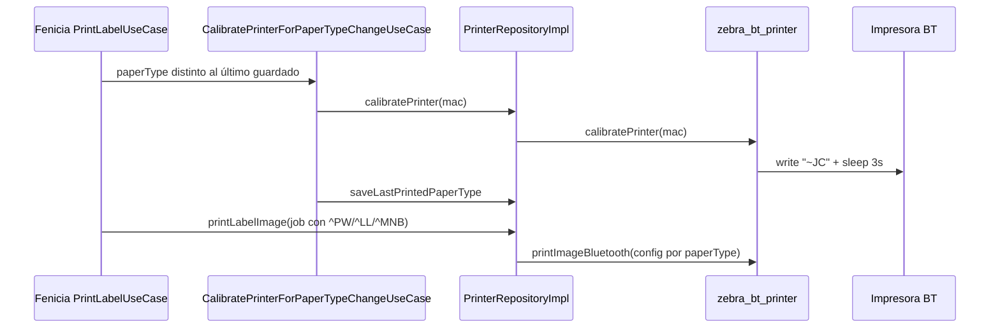
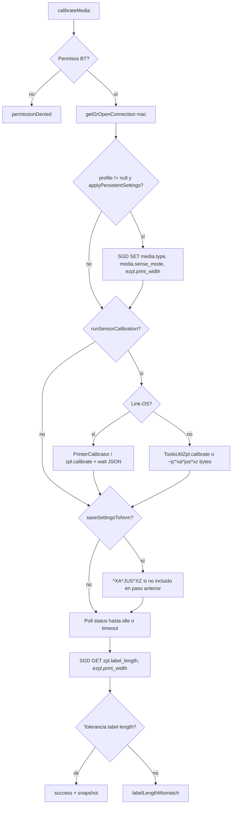

# Diseño — Calibración de media y tamaño de impresión Zebra

Documento de diseño para cerrar la brecha entre la **calibración automática al cambiar tipo de etiqueta** (12up / 24up) y la **calibración manual** que hoy el operador debe repetir en la impresora para que el **tamaño físico** (avance de papel, longitud guardada, ancho de impresión) coincida con el rollo cargado.

**Audiencia principal:** equipo del repositorio [`zebra_bt_printer`](https://github.com/sorianati/zebra_bt_printer) (plugin Flutter + capa Android).  
**Consumidor de referencia:** Fenicia Móvil (`fenicia_movil`), que hoy usa el plugin vía Git (`ref: v1.5.0`).

> **Relacionado:** `docs/impresoras/guia_integracion_zebra_bt_printer.md`, `docs/impresoras/flujo_config_impresoras.md`, documentación del plugin `doc/INTEGRACION.md` / `doc/INTEGRATION.md`.

---

## Resumen ejecutivo

| Hoy | Problema observado | Objetivo del diseño |
|-----|-------------------|---------------------|
| Fenicia detecta cambio `12up` ↔ `24up` y llama `ZebraBtPrinter.calibratePrinter()` | Tras esa calibración, la impresión sigue comportándose como el rollo anterior hasta una **segunda calibración manual** en el menú de la Zebra | Exponer en el plugin un flujo de calibración **equivalente al manual**, usando el **SDK Link-OS ya embebido**, con espera de fin real y perfil de media coherente con cada impresión |

La solución **no** sustituye `PrinterConfig` por job (`^PW`, `^LL`, `^MN`): lo complementa sincronizando **configuración persistente** de la impresora (`media.*`, `zpl.label_length`, `ezpl.print_width`) cuando cambia el rollo lógico.

---

## Contexto en Fenicia Móvil (consumidor)

### Flujo actual



### Archivos relevantes (solo referencia; cambios posteriores en Fenicia)

| Pieza | Ubicación |
|-------|-----------|
| Detección cambio 12up/24up | `lib/domain/usecases/calibrate_printer_for_paper_type_change_usecase.dart` |
| Calibración simple (~JC) | `lib/domain/usecases/calibrate_printer_usecase.dart` |
| Geometría por papel | `lib/domain/entities/print_label_geometry.dart`, `print_label_constants.dart` |
| Wrapper plugin | `lib/data/datasources/printer_device.dart` → `ZebraBtPrinter.calibratePrinter` |
| Settle post-calibración | `PrintLabelConstants.postCalibrateSettle` (5 s) en `printer_repository_impl.dart` |

### Geometría que Fenicia envía en cada impresión

| `paperType` | Ancho (dots) | Alto (dots) | Mark media (`^MNB`) | `allowUpscale` |
|-------------|--------------|-------------|---------------------|----------------|
| `24up` | 600 | 250 | sí | no |
| `12up` | 575 | 565 | sí | sí |

Ambos rollos usan **marca negra** en tienda; el plugin recibe `LabelMediaType.mark` cuando `useMarkMedia == true`.

---

## Estado actual del plugin (`zebra_bt_printer` v1.5.0)

### API Dart expuesta

- `ZebraBtPrinter.calibratePrinter({required String mac})` → `Future<bool>`
- Documentación: calibración del **sensor de media** vía ZPL `~JC`.

### Implementación Android (`ZebraBtPrinterPlugin.kt`)

```kotlin
conn.write("~JC".toByteArray())
Thread.sleep(3000)
// success(true) — sin poll de status ni respuesta JSON
```

### Limitaciones identificadas

1. **Secuencia incompleta:** Zebra recomienda, para varios modelos móviles, configurar `media.type` / `media.sense_mode` y luego enviar `~jc^xa^jus^xz` (guardar configuración), no solo `~JC` suelto.
2. **Sin confirmación:** no usa `ToolsUtil.calibrate()` ni `PrinterCalibrator` (`zpl.calibrate` + `sendAndWaitForValidJsonResponse`) del SDK.
3. **Sin SGD:** no actualiza `ezpl.print_width` ni valida `zpl.label_length` tras calibrar.
4. **Desacople con impresión:** cada job ya manda `^LL`/`^PW`, pero la impresora puede seguir usando **longitud/ancho guardados** para alimentación y escala hasta que NVM y sensor queden alineados.

---

## Conceptos Zebra (qué calibra cada cosa)

| Concepto | Mecanismo típico | Efecto |
|----------|------------------|--------|
| **Calibración de sensor / longitud de media** | `~JC`, SDK `ToolsUtil.calibrate()`, SGD `zpl.calibrate` | Mide gaps/marcas; actualiza `zpl.label_length` en la impresora |
| **Ancho de impresión persistente** | SGD `ezpl.print_width` (dots) | Ancho físico de la banda imprimible guardado en NVM |
| **Tipo y modo de media** | SGD `media.type`, `media.sense_mode` (`gap` / `bar`) | Debe coincidir con el rollo antes de calibrar |
| **Longitud por job** | ZPL `^LL` en cada formato | Aplica al trabajo actual; no siempre anula comportamiento de feed si NVM está desfasado |
| **Fijar longitud sin medir** | ZPL `~JL` | Alimenta blancos y fija longitud (casos especiales) |

La “segunda calibración manual” en campo suele combinar **sensor + guardado en NVM + ancho**, no solo el `~JC` mínimo que envía el plugin hoy.

### Referencias externas

- [Calibration and Media Feed Commands (~JC, ~JL, …)](https://docs.zebra.com/us/en/printers/software/zpl-pg/c-zpl-adv-techn-advanced-techniques/r-zpl-adv-techn-calibration-media-feed-commands.html)
- [ZQ310/ZQ320 — secuencia `media.*` + `~jc^xa^jus^xz`](https://support.zebra.com/article/ZQ310-and-ZQ320-Media-Calibration)
- [Link-OS — `ToolsUtil.Calibrate`](https://techdocs.zebra.com/link-os/latest/pc_net/content/v403435/html/10a06bf3-4af8-af9e-c8f8-19c42276a785)
- Hilo desarrollador: calibración programática y lectura de `zpl.label_length` — [developer.zebra.com/thread/36977](https://developer.zebra.com/thread/36977)

---

## Objetivos y no-objetivos

### Objetivos

1. Ofrecer en `zebra_bt_printer` una calibración **completa y esperada** al cambiar perfil de etiqueta (ancho/alto/sense), alineada con Fenicia 12up/24up.
2. Usar el **SDK Link-OS** (`ZebraPrinterFactory`, `ToolsUtil`, `SGD`, `PrinterCalibrator` cuando aplique) en lugar de `~JC` + sleep fijo.
3. Devolver resultado **tipado** (éxito, timeout, error de conexión, valor de `label_length` leído) para que la app deje de adivinar con delays.
4. Mantener compatibilidad: el método actual puede delegar al nuevo flujo con opciones por defecto.

### No-objetivos (v1 de este diseño)

- Calibración **RFID** o perfiles fuera de ZPL/mark/gap estándar de tienda.
- UI en la impresora (`display.calibrate`) — solo vía comandos/SDK.
- Soporte iOS (sigue stub; calibración solo Android).
- Descubrimiento BT o selección de impresora.

---

## Diseño propuesto — API del plugin (`zebra_bt_printer`)

### 1. Perfil de media (`MediaCalibrationProfile`)

Modelo Dart que describe **qué rollo lógico** se está cargando. El plugin traduce a SGD + calibración; la app consumidora no envía comandos ZPL crudos.

```dart
/// Perfil de calibración al cambiar rollo o tipo de etiqueta.
class MediaCalibrationProfile {
  const MediaCalibrationProfile({
    required this.printWidthDots,
    required this.labelLengthDots,
    required this.mediaSense,
    this.mediaType = MediaType.label,
    this.maxLabelLengthDots,
  });

  /// Ancho de impresión persistente → SGD `ezpl.print_width`.
  final int printWidthDots;

  /// Longitud esperada (dots) → referencia para validar `zpl.label_length` tras calibrar.
  final int labelLengthDots;

  /// Gap entre etiquetas vs marca negra en reverso.
  final MediaSenseMode mediaSense;

  /// Casi siempre `label` en Fenicia; `journal` solo si en el futuro hay continuo.
  final MediaType mediaType;

  /// Opcional → alinear con ZPL `^ML` / `ezpl.label_length_max` si hace falta.
  final int? maxLabelLengthDots;
}

enum MediaSenseMode { gap, bar }

enum MediaType { label, journal }
```

**Presets recomendados para Fenicia** (misma fuente que `PrintLabelConstants`):

| Preset | `printWidthDots` | `labelLengthDots` | `mediaSense` |
|--------|------------------|-------------------|--------------|
| `MediaCalibrationProfile.fenicia24Up` | 600 | 250 | `bar` |
| `MediaCalibrationProfile.fenicia12Up` | 575 | 565 | `bar` |

Los presets pueden vivir en el plugin (`lib/src/presets/soriana_media_profiles.dart`) o solo documentarse; Fenicia puede construir el perfil desde su domain sin acoplar nombres de negocio al plugin.

### 2. Opciones de ejecución (`CalibrateMediaOptions`)

```dart
class CalibrateMediaOptions {
  const CalibrateMediaOptions({
    this.profile,
    this.applyPersistentSettings = true,
    this.runSensorCalibration = true,
    this.saveSettingsToNvm = true,
    this.timeout = const Duration(seconds: 45),
    this.labelLengthToleranceDots = 40,
  });

  /// Si null, solo ejecuta calibración de sensor sin cambiar SGD (modo legacy mejorado).
  final MediaCalibrationProfile? profile;

  /// Si true: SET `media.type`, `media.sense_mode`, `ezpl.print_width` antes de calibrar.
  final bool applyPersistentSettings;

  /// Si true: ejecuta calibración de sensor (SDK / `zpl.calibrate` o secuencia ZPL).
  final bool runSensorCalibration;

  /// Si true: envía `^XA^JUS^XZ` o equivalente SDK para persistir en NVM.
  final bool saveSettingsToNvm;

  final Duration timeout;

  /// Tolerancia al comparar `labelLengthDots` con `SGD GET zpl.label_length`.
  final int labelLengthToleranceDots;
}
```

### 3. Resultado (`CalibrateMediaResult`)

Reemplazar o complementar el `Future<bool>` opaco.

```dart
class CalibrateMediaResult {
  final bool isSuccess;
  final CalibrateMediaErrorCode? errorCode;
  final String? errorMessage;

  /// Valor leído tras calibrar (SGD `zpl.label_length`), si disponible.
  final int? detectedLabelLengthDots;

  /// Valor leído de `ezpl.print_width`, si se aplicó perfil.
  final int? appliedPrintWidthDots;

  /// Tiempo real de la operación (diagnóstico).
  final Duration elapsed;
}

enum CalibrateMediaErrorCode {
  invalidArgs,
  permissionDenied,
  connectError,
  calibrateError,
  calibrateTimeout,
  labelLengthMismatch, // calibró pero longitud fuera de tolerancia
  unsupportedPrinter,  // no Link-OS y fallback falló
  unknown,
}
```

### 4. Método público principal

```dart
abstract class ZebraBtPrinter {
  /// Calibración legacy — delega a [calibrateMedia] con opciones mínimas.
  @Deprecated('Use calibrateMedia(mac: mac, options: CalibrateMediaOptions())')
  static Future<bool> calibratePrinter({required String mac});

  /// Calibración de media + opcional sincronización de tamaño persistente.
  static Future<CalibrateMediaResult> calibrateMedia({
    required String mac,
    CalibrateMediaOptions options = const CalibrateMediaOptions(),
  });

  /// Solo lectura — útil para diagnóstico sin calibrar.
  static Future<PrinterMediaSnapshot?> getMediaSnapshot({
    required String mac,
  });
}

class PrinterMediaSnapshot {
  final int? labelLengthDots;   // zpl.label_length
  final int? printWidthDots;    // ezpl.print_width
  final String? mediaType;      // media.type
  final String? mediaSenseMode; // media.sense_mode
}
```

**Regla de compatibilidad:** `calibratePrinter` sigue existiendo en 1.x; implementación interna = `calibrateMedia` con `runSensorCalibration: true`, `applyPersistentSettings: false`, y mapeo a `bool` (`isSuccess`).

### 5. MethodChannel (Android)

| Método | Argumentos | Retorno |
|--------|------------|---------|
| `calibrateMedia` | `mac`, mapa de `options` + `profile` | mapa → `CalibrateMediaResult` |
| `getMediaSnapshot` | `mac` | mapa o null |
| `calibratePrinter` | `mac` | `bool` (sin cambio de firma) |

---

## Diseño propuesto — Implementación nativa (Android)

### Diagrama de flujo



### Pasos detallados

1. **Conexión**  
   Reutilizar `getOrOpenConnection(mac)` y el mismo criterio de permisos que impresión.

2. **Aplicar perfil (si `applyPersistentSettings`)**  
   Usar `com.zebra.sdk.printer.SGD`:

   ```text
   ! U1 setvar "media.type" "label"
   ! U1 setvar "media.sense_mode" "bar"   // Fenicia mark media
   ! U1 setvar "ezpl.print_width" "<printWidthDots>"
   ```

   Opcional si el modelo lo requiere: `ezpl.label_length_max` acorde a `maxLabelLengthDots` o `labelLengthDots * 2`.

3. **Calibración de sensor**  
   **Preferido (Link-OS):** instanciar calibración vía SDK (`PrinterCalibrator` / operación `zpl.calibrate`) con `sendAndWaitForValidJsonResponse` dentro de `timeout`.  
   **Fallback (ZPL):** escribir secuencia en UTF-8:

   ```text
   ~JC^XA^JUS^XZ
   ```

   Evitar el `sleep(3000)` fijo como único criterio de éxito.

4. **Espera de fin**  
   Reutilizar lógica similar a `awaitBatchSettled`: `isReadyToPrint`, buffer vacío, sin papel. Si tras calibración la impresora permanece “busy” más de `timeout`, devolver `calibrateTimeout`.

5. **Validación post-calibración**  
   - `SGD.GET("zpl.label_length", connection)`  
   - Comparar con `profile.labelLengthDots ± labelLengthToleranceDots` si hay perfil.  
   - Si falla tolerancia: `labelLengthMismatch` (la app puede mostrar mensaje “recalibra manualmente” o reintentar una vez).

6. **Cierre de sesión**  
   Documentar si la conexión persistente debe cerrarse tras calibrar (Fenicia hoy llama `disconnectPersistentConnection` + settle). El plugin puede exponer flag `closeConnectionAfter: true` por defecto para no dejar la impresora en estado intermedio.

### iOS

`calibrateMedia` / `getMediaSnapshot` devuelven `unsupportedPlatform` o `isSuccess: false` con código existente `UNSUPPORTED_PLATFORM`, sin lanzar.

### Errores nativos → Dart

| Código nativo | `CalibrateMediaErrorCode` |
|---------------|---------------------------|
| `CALIBRATE_ERROR` | `calibrateError` |
| `CALIBRATE_TIMEOUT` | `calibrateTimeout` (nuevo) |
| `LABEL_LENGTH_MISMATCH` | `labelLengthMismatch` (nuevo) |
| `PERMISSION_DENIED` | `permissionDenied` |
| `CONNECT_ERROR` | `connectError` |

Ampliar `PrintErrorCode` solo si se desea unificar con impresión; alternativa: enums separados para no romper mapeos actuales de `PrintResult`.

---

## Integración prevista en Fenicia (tras publicar plugin)

Cambios **fuera** del repo del plugin; incluidos aquí para que el equipo de la librería entienda el contrato.

1. **`PrinterDeviceDataSource`**  
   - Nuevo método `calibrateMedia(mac, MediaCalibrationProfile)` o pasar perfil desde domain.  
   - Mapear `CalibrateMediaResult` → `Either<Failure, void>` / `PrintErrorKind`.

2. **`CalibratePrinterForPaperTypeChangeUseCase`**  
   - Construir `MediaCalibrationProfile` desde `PrintLabelGeometry.forPaperType(paperType)`.  
   - Llamar `calibrateMedia` con `applyPersistentSettings: true`, `saveSettingsToNvm: true`.  
   - Reducir o eliminar `postCalibrateSettle` fijo si el plugin confirma fin por status.

3. **`CalibratePrinterUseCase` (config impresora / QR)**  
   - Valorar perfil por defecto `fenicia24Up` o perfil “genérico” solo sensor.

4. **Mensajes UI**  
   - Nuevo kind o subtipo para `labelLengthMismatch` en `print_error_catalog.dart`.

5. **Versión**  
   - Subir dependencia Git a tag que incluya `calibrateMedia` (p. ej. `v1.6.0`).

---

## Pruebas

### En el repositorio `zebra_bt_printer`

| Tipo | Qué cubrir |
|------|------------|
| Unit Kotlin | Parseo de `CalibrateMediaOptions` desde `MethodCall`; mapeo de excepciones a códigos |
| Unit Dart | Serialización options/result; fake platform `calibrateMedia` |
| Integración manual | Matriz hardware: modelo ZQ/ZD usado en tienda, 12up y 24up, cambio A→B→A |
| Regresión | `calibratePrinter` legacy sigue retornando `true` en happy path |

**Criterios de aceptación en campo**

1. Tras cambiar de 24up a 12up **solo desde la app** (sin menú impresora), la primera etiqueta imprime con **alto físico** coherente (~565 dots) y sin recorte del rollo anterior.  
2. `getMediaSnapshot` muestra `zpl.label_length` dentro de tolerancia del perfil.  
3. No se requiere segunda calibración manual en ≥ N pruebas consecutivas (definir N con operaciones, p. ej. 10).

### En Fenicia (después de integrar)

- Actualizar tests de `calibrate_printer_for_paper_type_change_usecase_test.dart` con mock del nuevo método.  
- Test de mapper para `labelLengthMismatch`.

---

## Versionado y rollout

| Versión plugin | Cambio |
|----------------|--------|
| **1.5.x** | Sin API nueva; opcional hotfix interno: `~JC^XA^JUS^XZ` + poll mínimo (si se necesita parche urgente sin Dart) |
| **1.6.0** | `calibrateMedia`, `getMediaSnapshot`, `CalibrateMediaResult`; deprecación suave de `calibratePrinter` |
| **2.0.0** | Solo si se elimina `calibratePrinter` o se cambia comportamiento por defecto de forma breaking |

Fenicia debe **fijar tag** en `pubspec.yaml` tras QA conjunto.

Changelog del plugin: documentar secuencia SGD, nuevos códigos de error y presets Soriana si se añaden al paquete.

---

## Tareas sugeridas para el repo `zebra_bt_printer`

Checklist copiable al backlog del plugin:

- [ ] Añadir modelos Dart: `MediaCalibrationProfile`, `CalibrateMediaOptions`, `CalibrateMediaResult`, `PrinterMediaSnapshot`
- [ ] MethodChannel `calibrateMedia` + `getMediaSnapshot`
- [ ] Implementar flujo Android con `SGD.SET` / `SGD.GET` y calibración Link-OS (`PrinterCalibrator` o `ToolsUtil.calibrate`)
- [ ] Sustituir `Thread.sleep(3000)` por espera basada en status / respuesta JSON
- [ ] Secuencia ZPL fallback `~JC^XA^JUS^XZ` para impresoras no Link-OS
- [ ] Códigos `CALIBRATE_TIMEOUT`, `LABEL_LENGTH_MISMATCH`
- [ ] Tests unitarios + actualizar `doc/INTEGRACION.md` y `doc/INTEGRATION.md` (§ calibración ampliada)
- [ ] Ejemplo en `example/lib`: botón “Calibrar 12up / 24up” con presets
- [ ] Tag release y notificar a Fenicia para bump de dependencia

---

## Riesgos y mitigaciones

| Riesgo | Mitigación |
|--------|------------|
| Modelos Zebra distintos interpretan SGD distinto | Matriz de pruebas en hardware; fallback ZPL; log de `getMediaSnapshot` en error |
| Calibración consume varias etiquetas | Documentar en UI Fenicia; no encadenar calibración en cada copia |
| `label_length` leído no coincide por tolerancia estrecha | `labelLengthToleranceDots` configurable; solo warning en logs si éxito “blando” es aceptable (decisión producto) |
| Carrera con conexión persistente | Cerrar o bloquear impresión durante `calibrateMedia`; documentar en INTEGRACION |

---

## Preguntas abiertas (resolver con operaciones / QA)

1. ¿Modelos exactos de impresora en tienda (ZQ320, ZQ630, etc.)? Ajusta timeouts y si hace falta power-cycle tras calibrar (algunos manuales Zebra lo mencionan).  
2. ¿Todos los rollos 12up/24up son **bar sense** o algún rollo usa **gap**?  
3. ¿Se acepta fallo `labelLengthMismatch` con reintento automático único?  
4. ¿Los presets de dots deben ser configurables por tienda vía backend o constantes bastan?

---

## Anexo — Mapeo comando / SGD

| Intención | Comando / SGD |
|-----------|----------------|
| Tipo de media | `media.type` = `label` |
| Marca negra | `media.sense_mode` = `bar` |
| Gap | `media.sense_mode` = `gap` |
| Ancho persistente | `ezpl.print_width` |
| Longitud detectada | `zpl.label_length` (GET tras calibrar) |
| Calibrar sensor | `zpl.calibrate` (JSON Link-OS) o `~JC` |
| Guardar NVM | `^XA^JUS^XZ` tras calibración / SET |
| Por job (ya en plugin) | `^PW`, `^LL`, `^MNA`/`^MNB`, `^ML`, `^LT` |

---

*Documento creado para coordinación Fenicia Móvil ↔ `zebra_bt_printer`. Actualizar cuando se cierre versión del plugin y la integración en app.*
